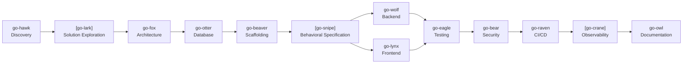
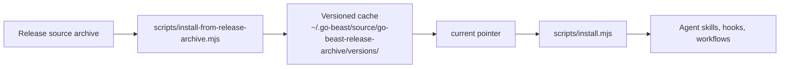

# go-beast


> A versioned skill pack for AI-assisted full-stack software development — from discovery to deployment.

Each skill is named `go-<animal>`. Each beast owns exactly one phase of the project lifecycle and produces concrete, named artifacts that feed the next beast in the chain. Skills are plain Markdown — agent-agnostic and usable with Claude Code, Cursor, Gemini, Copilot, and more. The canonical source lives in `skills/`. The repo also ships optional harness-specific adapters in `plugins/go-beast/` for surfaces that expect a manifest plus a dedicated `skills/` directory.

**Version 1.44.0** · [Changelog](CHANGELOG.md)

## Summary

- [Pipeline](#pipeline) - ordered beast chain and optional branches
- [Getting started](#getting-started) - the fastest way to install or explore the pack
- [Skills](#skills) - phase-by-phase skill index
- [Installation](#installation) - checkout-based install, repo-free archive bootstrap, bootstrap mode
- [Release archive bootstrap](#release-archive-bootstrap) - repo-free install path with update-safe reruns
- [Validation](#validation) - repo-local checks and live harness tests
- [Architecture docs](#architecture-docs) - maintainer-facing design notes and protocols

If you only want to install the pack, start at [Getting started](#getting-started).
If you want to understand the full lifecycle, read [Pipeline](#pipeline) next.

## Getting Started

Pick the path that matches your situation:

| Situation | Command | What it does |
|---|---|---|
| You are maintaining go-beast locally | `git clone <repo-url> <repo-dir>` then `node <repo-dir>/scripts/install.mjs` | Uses the checkout-based installer from the cloned repo |
| You do not want to clone the repo | `bash -c "$(curl -fsSL https://raw.githubusercontent.com/MarcosAlves90/go-beast/main/scripts/install.sh)" -- --all` | Opens a release menu, downloads the selected archive, and installs from it |
| You want bootstrap mode too | `bash -c "$(curl -fsSL https://raw.githubusercontent.com/MarcosAlves90/go-beast/main/scripts/install.sh)" -- --all --bootstrap` | Runs the same repo-free installer and enables bootstrap mode |

Use the checkout-based path for repo maintenance and the release archive path
for machines that should stay repo-free.

## Pipeline



> `[brackets]` = optional. go-bear can interrupt any beast. go-owl can run at any phase.


## Skills

### Pipeline skills

| Skill | Phase | Produces |
|---|---|---|
| [go-hawk](skills/go-hawk/SKILL.md) | Discovery | `REQUIREMENTS.md`, scope, handoff plan |
| [go-lark](skills/go-lark/SKILL.md) | Solution Exploration | `APPROACH.md` — 3–5 options evaluated, one selected |
| [go-fox](skills/go-fox/SKILL.md) | Architecture | `ADR.md`, `STACK.md`, `DIAGRAM.md`, `CONTRACTS.md` |
| [go-otter](skills/go-otter/SKILL.md) | Database | ER diagram, migrations, index strategy |
| [go-beaver](skills/go-beaver/SKILL.md) | Scaffolding | Working repo skeleton, tooling, `.env.example`, `SETUP.md` |
| [go-snipe](skills/go-snipe/SKILL.md) | Behavioral Specification | `SPEC.md` — BDD scenarios, acceptance criteria, acceptance test skeleton |
| [go-wolf](skills/go-wolf/SKILL.md) | Backend | REST/GraphQL API, auth, middleware, validation |
| [go-lynx](skills/go-lynx/SKILL.md) | Frontend | Components, state, API integration, a11y |
| [go-eagle](skills/go-eagle/SKILL.md) | Testing | Test pyramid, unit/integration/E2E, CI gates, `TESTING.md` |
| [go-bear](skills/go-bear/SKILL.md) | Security | OWASP review, `THREAT_MODEL.md`, `SECURITY_REVIEW.md` |
| [go-raven](skills/go-raven/SKILL.md) | CI/CD | Pipeline, environments, release automation |
| [go-crane](skills/go-crane/SKILL.md) | Observability | Logging, metrics, tracing, health endpoints, `OBSERVABILITY.md` |
| [go-owl](skills/go-owl/SKILL.md) | Documentation | README, API reference, runbooks, changelog |

### Meta-skills

Invoked on demand — not bound to a phase.

| Skill | Invoke when |
|---|---|
| [go-mole](skills/go-mole/SKILL.md) | Starting work on an unfamiliar project — before other beasts |
| [go-kite](skills/go-kite/SKILL.md) | Strategic audit of an existing system before go-fox revisions |
| [go-ant](skills/go-ant/SKILL.md) | A performance problem has a numeric baseline and needs a fix |
| [go-mule](skills/go-mule/SKILL.md) | Explicitly initializing go-beast for a new agent session or environment, especially without SessionStart hooks |
| [go-jay](skills/go-jay/SKILL.md) | Authoring or syncing AI context files (CLAUDE.md, AGENTS.md, GEMINI.md…) |
| [go-swift](skills/go-swift/SKILL.md) `[Claude Code · Codex · Copilot CLI]` | Creating new lifecycle hook scripts |
| [go-wren](skills/go-wren/SKILL.md) `[Claude Code · Codex · Copilot CLI]` | Patching an existing lifecycle hook |
| [go-smith](skills/go-smith/SKILL.md) | A gap in the pack is identified and a new beast is needed |
| [go-chat](skills/go-chat/SKILL.md) | Technical conversation — code walkthroughs, architectural debates, decision support, rubber-duck debugging, and Q&A before work begins |
| [go-tern](skills/go-tern/SKILL.md) | Reviewing a diff, task output, or branch before merge or handoff |
| [go-score](skills/go-score/SKILL.md) | Scored code review — 0–4 per dimension, OIR findings, BLOCKER/WARNING/SUGGESTION/NIT severity, merge verdict |
| [go-marten](skills/go-marten/SKILL.md) | Setting up and governing isolated git worktrees for risky or parallel work |
| [go-finch](skills/go-finch/SKILL.md) | An existing skill needs improvement after eval feedback |
| [go-vole](skills/go-vole/SKILL.md) | Designing or restructuring an Obsidian vault / PKM system |
| [go-bee](skills/go-bee/SKILL.md) | Designing and implementing multi-agent Workflow scripts (pipeline, parallel, loop patterns) |


## Hooks `[Claude Code · Codex · Copilot CLI]`

Automated guards that run on agent lifecycle events. The installer symlinks hook scripts and writes the agent hook config automatically from the shared manifest, while preserving any existing entries. Claude Code uses `~/.claude/settings.json`; Codex uses `~/.codex/hooks.json` or inline `[hooks]` tables in `~/.codex/config.toml`, then reviews them with `/hooks`; Copilot CLI loads `~/.copilot/hooks/*.json` and the installer writes `~/.copilot/hooks/go-beast.json` with camelCase event names (`sessionStart`, `userPromptSubmitted`, `agentStop`, `preToolUse`, `postToolUse`).

| Hook | Event | What it does |
|---|---|---|
| `sync-go-beast-skills.sh` | `SessionStart` | Syncs skills, workflows, hooks, and global instructions for Claude Code, Codex, and Copilot CLI |
| `go-beast-session-state.sh` | `SessionStart` | Initializes shared anti-drift session state for go-beast-aware harness hooks |
| `go-beast-user-prompt-context.sh` | `UserPromptSubmit` | Re-injects the active go-beast workflow frame before each prompt |
| `go-beast-stop-reanchor.sh` | `Stop` | Forces a re-anchor when bootstrap sessions drift away from beast/artifact framing |
| `git-commit-guard.sh` | `PreToolUse (Bash)` | Blocks commits of `.env`, credentials, build artifacts |
| `git-strip-coauthored.sh` | `PreToolUse (Bash)` | Blocks commits with `Co-Authored-By` tag |
| `code-dedup-check.sh` | `PreToolUse (Edit/Write)` | Warns when a new function/class already exists in the project |
| `code-verify-flag.sh` | `PostToolUse (Edit/Write)` | Flags the project for post-session type-check and test run |
| `code-verify-run.sh` | `Stop` | Runs tsc / mypy / go vet / cargo check + tests when source was modified |
| `docs-update-flag.sh` | `PostToolUse (Edit/Write)` | Flags the project when source code files are modified |
| `docs-update-remind.sh` | `Stop` | Blocks session close until README, docstrings, and CHANGELOG are reviewed |
| `git-commit-remind-flag.sh` | `PostToolUse (Edit/Write/MultiEdit)` | Flags the git repo when files are modified |
| `git-commit-remind.sh` | `Stop` | Reminds the agent to ask about committing/pushing uncommitted changes and to use Conventional Commits |
| `version-bump-remind.sh` | `Stop` | Reminds the agent to run the release-version workflow when CHANGELOG.md has `[Unreleased]` content |


## Workflows `[Claude Code]`

| Workflow | Purpose |
|---|---|
| [go-skill-eval](workflows/go-skill-eval.js) | Evaluates all go-* skills: structural checklist + LLM-as-judge + A/B/C/D adversarial inputs |
| [go-hook-eval](workflows/go-hook-eval.js) | Tests all hooks: 34 cases covering blockers, observers, anti-drift state, jq fallback, and flag files |
| [go-workflow-eval](workflows/go-workflow-eval.js) | Evaluates Workflow scripts: structural checklist + LLM judge for correctness, coverage, and design patterns |
| [go-deep-analysis](workflows/go-deep-analysis.js) | Deep multi-dimensional codebase analysis: architecture, security, performance, testing, docs gaps, dependency health — one Markdown doc per dimension |


## Installation

Skills are plain Markdown files — any agent that can read files can use them.

**Rule:** anything in this repository that depends on a specific AI surface,
harness, hook schema, plugin system, or live agent runtime is optional. The core
pack remains the canonical `skills/` directory plus the plain Markdown docs
they depend on.

Start here:

1. Use the checkout-based installer if you are maintaining or editing go-beast.
2. Use the release archive bootstrap if you want to install without cloning the repo.
3. Omit archive flags to fetch the latest GitHub release automatically.
4. Pass `--archive-url` when you already know the release URL.
5. Pass `--archive` when you already have a local tarball.

### Plugin adapter bundle

The repository now includes `plugins/go-beast/`, a plugin-oriented adapter that
packages the canonical `skills/go-*` skills behind optional Codex and Claude plugin
manifests.

This adapter is intentionally narrow:

- it exposes optional plugin metadata and a dedicated `skills/` directory
- it does **not** replace `skills/` as the source of truth
- it does **not** wire hooks through the plugin manifest; hook installation
  remains handled by `scripts/install.mjs` and `hooks/sync-go-beast-skills.sh`

### Explicit initialization skill

`go-mule` is the manual, user-invoked alternative to the automatic
`sync-go-beast-skills.sh` path.

Prefer `go-mule` when:

- hooks are unavailable, untrusted, or undesirable
- the user wants a planning-only or read-only bootstrap first
- the environment supports skills but not reliable SessionStart automation
- you need to separate core setup (`skills/`, `AGENTS.global.md`,
  `AGENTS.bootstrap.md`, `scripts/install.mjs`) from optional Codex or Claude
  hook wiring

Prefer the sync hook when:

- the environment already trusts SessionStart automation
- the user wants ongoing background refresh of skills, workflows, hooks, and
  global instructions
- the machine is already instrumented and automatic drift correction is desired

Use `go-mule` first when you need an explicit bootstrap contract. Use the sync
hook after that only if the user wants automation to take over.

### Optional bootstrap mode

`go-beast` now ships an optional stricter bootstrap in `AGENTS.bootstrap.md`.
When enabled, SessionStart sync installs that file instead of `AGENTS.global.md`
and pushes the agent toward `go-mole`, `go-hawk`, and `go-lark` before
implementation.

Enable it with:

```bash
node scripts/install.mjs --bootstrap
```

Or choose bootstrap mode in the interactive installer. The choice is persisted
at `~/.go-beast/bootstrap.enabled`.

### Interactive installer (macOS · Linux · Windows)

Requires Node.js 18+. No external dependencies.

Command guide:

| Command | Use when | Outcome |
|---|---|---|
| `node scripts/install.mjs` | You have a local checkout and want to choose what to install | Opens the interactive installer against the checkout |
| `node scripts/install.mjs --all` | You want everything from a local checkout without prompts | Installs all supported skills, hooks, and workflows |
| `node scripts/install.mjs --all --bootstrap` | You want the checkout install plus stricter bootstrap mode | Installs everything and writes `AGENTS.bootstrap.md` |

```bash
git clone <repo-url> <repo-dir>
node <repo-dir>/scripts/install.mjs
```

Use this path when you have a local checkout.

What it does:

- detects which agents are installed
- lets you choose which skills, hooks, and Claude Code workflows to install
- creates symlinks from the checkout into each selected agent
- writes hook config only for the agents you actually have installed and selected
- copies the selected global instructions file for each selected agent

This remains the supported installation path for optional hooks and global
instructions even when the plugin adapter bundle is used for skill packaging.

```bash
node scripts/install.mjs --all
node scripts/install.mjs --all --bootstrap
node scripts/install.mjs --uninstall
```

- `--all` installs everything without prompts.
- `--bootstrap` writes the stricter bootstrap instructions instead of the standard ones.
- `--uninstall` removes symlinks that point back to the checkout.

### Release archive bootstrap

Use this path when you do not want to clone the repository.

Command guide:

| Command | Use when | Outcome |
|---|---|---|
| `bash -c "$(curl -fsSL https://raw.githubusercontent.com/MarcosAlves90/go-beast/main/scripts/install.sh)" -- --all` | You want repo-free install from a terminal | Shows a menu for latest or specific release, then installs everything |
| `bash -c "$(curl -fsSL https://raw.githubusercontent.com/MarcosAlves90/go-beast/main/scripts/install.sh)" -- --all --bootstrap` | You want repo-free install plus bootstrap mode | Shows the same release menu and writes bootstrap instructions |

The menu first asks whether to install the latest release or choose a specific
release. If you choose a specific release, it lists the published GitHub
releases and downloads the selected archive.

How it works:

1. The wrapper finds the archive source.
2. It extracts the archive into `~/.go-beast/source/go-beast-release-archive/`.
3. It refreshes the active source pointer.
4. It runs the canonical installer from that active tree.

Archive source options:

- menu option 1: fetch the latest GitHub release automatically
- menu option 2: show published releases and install the selected one
- `--archive-url <url>`: fetch a specific archive URL
- `--archive <path>`: use a local archive you already downloaded



```bash
bash -c "$(curl -fsSL https://raw.githubusercontent.com/MarcosAlves90/go-beast/main/scripts/install.sh)" -- --all
bash -c "$(curl -fsSL https://raw.githubusercontent.com/MarcosAlves90/go-beast/main/scripts/install.sh)" -- --all --bootstrap
```

The archive-based path keeps the checkout-based installer available for
maintainers while giving end users a repo-free bootstrap option. Re-running the
same command with a newer archive updates the active source pointer in place,
so installed links follow the new version without a manual cleanup step.

### Validation

Structural and repo-local checks:

```bash
npm run sync:plugin-skills
npm run release:version:check
npm run test:plugin
npm run test:plugin:release-version
```

Release flow:

```bash
node scripts/release-version.mjs release --bump <patch|minor|major>
node scripts/release-version.mjs publish
```

`publish` creates the annotated git tag, pushes it to `origin`, dispatches
`release-finalize.yml`, and waits for the GitHub Release to leave draft
state. Set `GH_BIN` to point the publish step at a GitHub CLI binary when
you want isolated credentials or a custom wrapper.

`.github/workflows/release-finalize.yml` uploads
`release-certificate.sigstore.json` to the release and publishes it. Because
immutable releases are enabled, GitHub then generates the actual release
attestation for the published release.

Live harness tests are opt-in because they require a working local harness
environment:

```bash
GO_BEAST_RUN_LIVE_AGENT_TESTS=1 npm run test:claude:go-mole
GO_BEAST_RUN_LIVE_AGENT_TESTS=1 npm run test:claude:bootstrap
GO_BEAST_RUN_LIVE_AGENT_TESTS=1 npm run test:claude:hook-wire
GO_BEAST_RUN_LIVE_AGENT_TESTS=1 npm run test:codex:hook-wire
GO_BEAST_RUN_LIVE_AGENT_TESTS=1 npm run test:codex:go-mule
GO_BEAST_RUN_LIVE_AGENT_TESTS=1 npm run test:codex:go-tern
GO_BEAST_RUN_LIVE_AGENT_TESTS=1 npm run test:codex:go-marten
```

These live tests are intentionally less brittle than exact-string snapshot
checks: they assert the expected skill artifacts and headings while tolerating
harmless wording differences between agent responses.

## Architecture docs

- [docs/architecture/AGENT_INSTRUCTION_CONTRACTS.md](docs/architecture/AGENT_INSTRUCTION_CONTRACTS.md) — explains how `AGENTS.global.md`, `AGENTS.bootstrap.md`, and repository-local `AGENTS.md` should be written and layered.
- [docs/architecture/MAINTAINER_PROTOCOLS.md](docs/architecture/MAINTAINER_PROTOCOLS.md) — defines the operational protocols for discovery, implementation, validation, PR/release, and blockers in maintainer-facing AI workflows.
- [docs/architecture/ADR-003-harness-bootstrap-architecture.md](docs/architecture/ADR-003-harness-bootstrap-architecture.md) — records the layer split between the core pack, harness adapters, and bootstrap policy.
- [docs/architecture/HARNESS_BOOTSTRAP_ARCHITECTURE.md](docs/architecture/HARNESS_BOOTSTRAP_ARCHITECTURE.md) — maintainer guide for classifying and changing harness and bootstrap behavior.

### Session-start auto-sync

The sync hook re-runs every session start and keeps the pack up to date
automatically for the optional hook-capable agents you use, currently Claude
Code and Codex.

```bash
# One-time setup
bash <repo-dir>/hooks/sync-go-beast-skills.sh
```

Add to `~/.claude/settings.json`:

```json
{
  "hooks": {
    "SessionStart": [
      { "command": "bash ~/.claude/hooks/sync-go-beast-skills.sh" }
    ]
  }
}
```

Use the same command in `~/.codex/hooks.json` if you wire Codex manually; this
is optional and only relevant if you use Codex.

After setup, skills are available as `/go-hawk`, `/go-fox`, etc. Workflows run via the Workflow tool or `/workflows`.

> **New skill created mid-session?** The sync only runs at session start. To activate a new beast immediately without waiting for the next session:
> ```bash
> bash <repo-dir>/hooks/sync-go-beast-skills.sh
> ```

### Codex hooks (optional)

Codex discovers hook configuration from `~/.codex/hooks.json` or inline
`[hooks]` tables in `~/.codex/config.toml`. The installer writes
`~/.codex/hooks.json` only when Codex is installed and selected, and preserves
existing entries; review new or changed hooks with `/hooks`.

### Copilot CLI hooks (optional)

Copilot CLI discovers hook configuration from `*.json` files in
`~/.copilot/hooks/`. The installer writes `~/.copilot/hooks/go-beast.json`
only when Copilot CLI is installed and selected, and preserves existing entries.
Skills are symlinked into `~/.copilot/skills/` and global instructions are
written to `~/.copilot/instructions/go-beast.md`. Review new or changed hooks
with `/hooks` in the Copilot CLI session.

### Other agents (Gemini CLI, Cursor…)

Clone the repo and point your agent at `skills/`. Each skill is a self-contained `SKILL.md` — no dependencies, no platform-specific syntax.

> `go-swift` and `go-wren` support Claude Code, Codex, and Copilot CLI hook schemas. Other agents may still need agent-specific guidance before hooks can be installed.


## Design principles

1. **One beast, one responsibility.** No skill duplicates another's work.
2. **Prerequisites are explicit.** Each skill states what it needs from previous beasts.
3. **Output is concrete.** Every skill produces named files. Nothing ends with "think about it."
4. **Security is not a phase.** go-bear can interrupt any beast at any time.
5. **Do not skip steps.** Each beast reduces the cost of every beast that follows.
6. **English only.** All content in this repo — skills, docs, commits, PRs — must be in English. See [AGENTS.md](AGENTS.md) for the full policy.

## Contribution patterns

- See [CONTRIBUTING.md](CONTRIBUTING.md) for the canonical contributor workflow.
- Issues: use `.github/ISSUE_TEMPLATE.md`, keep one concrete problem per issue, and list related items explicitly.
- PRs: use `.github/pull_request_template.md`, keep one concrete problem per PR, and include a GitHub closing keyword such as `Closes #123` when the PR resolves an issue.
