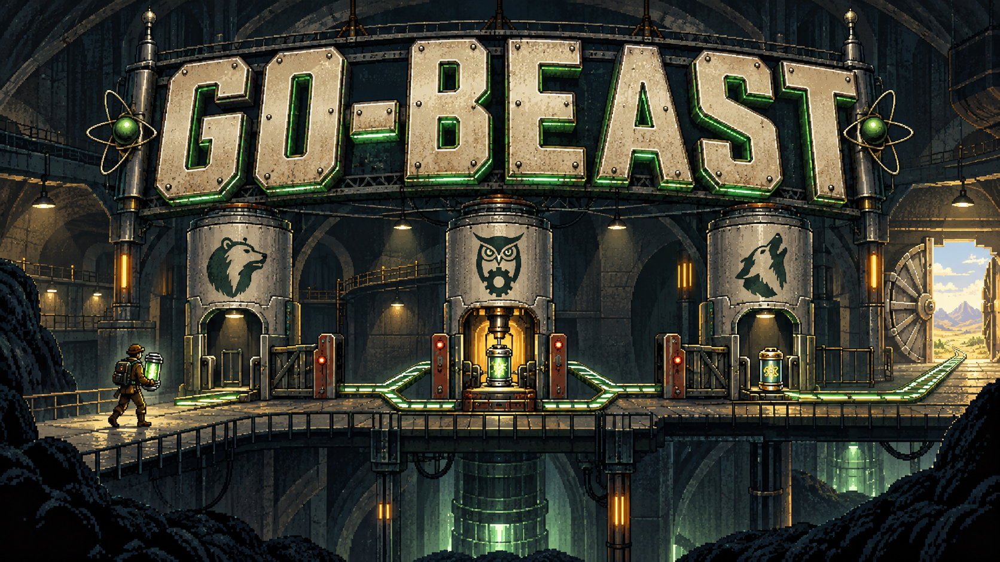

# go-beast



> A versioned skill pack for AI-assisted full-stack software development — from discovery to deployment.

Each skill is named `go-<animal>`. Each beast owns exactly one phase of the project lifecycle and produces concrete, named artifacts that feed the next beast in the chain. Skills are plain Markdown — agent-agnostic and usable with Claude Code, Cursor, Gemini, Copilot, and more.

**Version 1.28.2** · [Changelog](CHANGELOG.md)


## Pipeline

```
go-hawk → [go-lark] → go-fox → go-otter → go-beaver
  → go-wolf + go-lynx → go-eagle → go-bear → go-raven → [go-crane] → go-owl
```

> `[brackets]` = optional. go-bear can interrupt any beast. go-owl can run at any phase.


## Skills

### Pipeline skills

| Skill | Phase | Produces |
|---|---|---|
| [go-hawk](go-hawk/SKILL.md) | Discovery | `REQUIREMENTS.md`, scope, handoff plan |
| [go-lark](go-lark/SKILL.md) | Solution Exploration | `APPROACH.md` — 3–5 options evaluated, one selected |
| [go-fox](go-fox/SKILL.md) | Architecture | `ADR.md`, `STACK.md`, `DIAGRAM.md`, `CONTRACTS.md` |
| [go-otter](go-otter/SKILL.md) | Database | ER diagram, migrations, index strategy |
| [go-beaver](go-beaver/SKILL.md) | Scaffolding | Working repo skeleton, tooling, `.env.example`, `SETUP.md` |
| [go-wolf](go-wolf/SKILL.md) | Backend | REST/GraphQL API, auth, middleware, validation |
| [go-lynx](go-lynx/SKILL.md) | Frontend | Components, state, API integration, a11y |
| [go-eagle](go-eagle/SKILL.md) | Testing | Test pyramid, unit/integration/E2E, CI gates, `TESTING.md` |
| [go-bear](go-bear/SKILL.md) | Security | OWASP review, `THREAT_MODEL.md`, `SECURITY_REVIEW.md` |
| [go-raven](go-raven/SKILL.md) | CI/CD | Pipeline, environments, release automation |
| [go-crane](go-crane/SKILL.md) | Observability | Logging, metrics, tracing, health endpoints, `OBSERVABILITY.md` |
| [go-owl](go-owl/SKILL.md) | Documentation | README, API reference, runbooks, changelog |

### Meta-skills

Invoked on demand — not bound to a phase.

| Skill | Invoke when |
|---|---|
| [go-mole](go-mole/SKILL.md) | Starting work on an unfamiliar project — before other beasts |
| [go-kite](go-kite/SKILL.md) | Strategic audit of an existing system before go-fox revisions |
| [go-ant](go-ant/SKILL.md) | A performance problem has a numeric baseline and needs a fix |
| [go-jay](go-jay/SKILL.md) | Authoring or syncing AI context files (CLAUDE.md, AGENTS.md, GEMINI.md…) |
| [go-swift](go-swift/SKILL.md) `[Claude Code · Codex]` | Creating new lifecycle hook scripts |
| [go-wren](go-wren/SKILL.md) `[Claude Code · Codex]` | Patching an existing lifecycle hook |
| [go-smith](go-smith/SKILL.md) | A gap in the pack is identified and a new beast is needed |
| [go-finch](go-finch/SKILL.md) | An existing skill needs improvement after eval feedback |
| [go-vole](go-vole/SKILL.md) | Designing or restructuring an Obsidian vault / PKM system |
| [go-bee](go-bee/SKILL.md) | Designing and implementing multi-agent Workflow scripts (pipeline, parallel, loop patterns) |


## Hooks `[Claude Code · Codex]`

Automated guards that run on agent lifecycle events. The installer symlinks hook scripts and writes the agent hook config automatically from the shared manifest, while preserving any existing entries. Claude Code uses `~/.claude/settings.json`; Codex uses `~/.codex/hooks.json` or inline `[hooks]` tables in `~/.codex/config.toml`, then reviews them with `/hooks`.

| Hook | Event | What it does |
|---|---|---|
| `sync-go-beast-skills.sh` | `SessionStart` | Syncs skills, workflows, hooks, and global instructions for Claude Code and Codex |
| `git-commit-guard.sh` | `PreToolUse (Bash)` | Blocks commits of `.env`, credentials, build artifacts |
| `git-strip-coauthored.sh` | `PreToolUse (Bash)` | Blocks commits with `Co-Authored-By` tag |
| `code-dedup-check.sh` | `PreToolUse (Edit/Write)` | Warns when a new function/class already exists in the project |
| `code-verify-flag.sh` | `PostToolUse (Edit/Write)` | Flags the project for post-session type-check and test run |
| `code-verify-run.sh` | `Stop` | Runs tsc / mypy / go vet / cargo check + tests when source was modified |
| `docs-update-flag.sh` | `PostToolUse (Edit/Write)` | Flags the project when source code files are modified |
| `docs-update-remind.sh` | `Stop` | Blocks session close until README, docstrings, and CHANGELOG are reviewed |
| `git-commit-remind-flag.sh` | `PostToolUse (Edit/Write/MultiEdit)` | Flags the git repo when files are modified |
| `git-commit-remind.sh` | `Stop` | Reminds the agent to ask about committing/pushing uncommitted changes and to use Conventional Commits |
| `version-bump-remind.sh` | `Stop` | Reminds the agent to bump version when CHANGELOG.md has `[Unreleased]` content |


## Workflows `[Claude Code]`

| Workflow | Purpose |
|---|---|
| [go-skill-eval](workflows/go-skill-eval.js) | Evaluates all go-* skills: structural checklist + LLM-as-judge + A/B/C/D adversarial inputs |
| [go-hook-eval](workflows/go-hook-eval.js) | Tests all hooks: 27 cases covering blockers, observers, jq fallback, flag files |
| [go-workflow-eval](workflows/go-workflow-eval.js) | Evaluates Workflow scripts: structural checklist + LLM judge for correctness, coverage, and design patterns |
| [go-deep-analysis](workflows/go-deep-analysis.js) | Deep multi-dimensional codebase analysis: architecture, security, performance, testing, docs gaps, dependency health — one Markdown doc per dimension |


## Installation

Skills are plain Markdown files — any agent that can read files can use them.

### Interactive installer (macOS · Linux · Windows)

Requires Node.js 18+. No external dependencies.

```bash
git clone <repo-url> ~/Documents/@cherry-c/go-beast
node ~/Documents/@cherry-c/go-beast/scripts/install.mjs
```

The installer detects which agents are installed, lets you choose which skills, hooks for hook-capable agents, and workflows (Claude Code only) to install, creates symlinks, and writes the hook config for Claude Code and Codex from the shared manifest without removing existing entries. It also copies `AGENTS.global.md` to the correct global instructions file for each agent.

```bash
node scripts/install.mjs --all       # install everything, no prompts
node scripts/install.mjs --uninstall # remove all repo symlinks
```

### Session-start auto-sync

The sync hook re-runs every session start and keeps the pack up to date automatically for Claude Code and Codex.

```bash
# One-time setup
bash ~/Documents/@cherry-c/go-beast/hooks/sync-go-beast-skills.sh
```

Add to `~/.claude/settings.json`:

```json
{
  "hooks": {
    "SessionStart": [
      { "command": "bash ~/.claude/hooks/sync-go-beast-skills.sh" }
    ]
  }
}
```

Use the same command in `~/.codex/hooks.json` if you wire Codex manually; the installer handles both agents automatically.

After setup, skills are available as `/go-hawk`, `/go-fox`, etc. Workflows run via the Workflow tool or `/workflows`.

> **New skill created mid-session?** The sync only runs at session start. To activate a new beast immediately without waiting for the next session:
> ```bash
> bash ~/Documents/@cherry-c/go-beast/hooks/sync-go-beast-skills.sh
> ```

### Codex hooks

Codex discovers hook configuration from `~/.codex/hooks.json` or inline `[hooks]` tables in `~/.codex/config.toml`. The installer now writes `~/.codex/hooks.json` automatically from the shared manifest and preserves existing entries; review new or changed hooks with `/hooks`.

### Other agents (Gemini CLI, Copilot CLI, Cursor…)

Clone the repo and point your agent at the skill directory. Each skill is a self-contained `SKILL.md` — no dependencies, no platform-specific syntax.

> `go-swift` and `go-wren` support Claude Code and Codex hook schemas. Other agents may still need agent-specific guidance before hooks can be installed.


## Design principles

1. **One beast, one responsibility.** No skill duplicates another's work.
2. **Prerequisites are explicit.** Each skill states what it needs from previous beasts.
3. **Output is concrete.** Every skill produces named files. Nothing ends with "think about it."
4. **Security is not a phase.** go-bear can interrupt any beast at any time.
5. **Do not skip steps.** Each beast reduces the cost of every beast that follows.
6. **English only.** All content in this repo — skills, docs, commits, PRs — must be in English. See [AGENTS.md](AGENTS.md) for the full policy.
