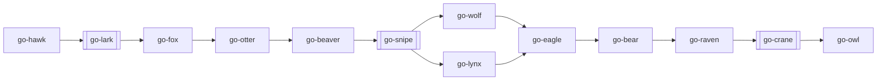

# Pipeline and catalog

The standard lifecycle is:

Brackets mark optional skills. `go-bear` can interrupt any phase, and
`go-owl` can run at any phase.

<!-- BEGIN GENERATED: semantic-skill-aliases -->
## Semantic skill aliases

Aliases are descriptive documentation only. The official identifiers remain the `go-*` names.

| Official skill | Semantic alias | Purpose |
|---|---|---|
| [go-ant](../skills/go-ant/SKILL.md) | `performance` | Profile and optimize proven performance bottlenecks. |
| [go-bear](../skills/go-bear/SKILL.md) | `security` | Review security posture and harden sensitive systems. |
| [go-beaver](../skills/go-beaver/SKILL.md) | `scaffold` | Create a runnable project skeleton and setup. |
| [go-bee](../skills/go-bee/SKILL.md) | `workflow` | Design multi-agent Workflow orchestration scripts. |
| [go-chat](../skills/go-chat/SKILL.md) | `conversation` | Conduct structured technical discussion and decision support. |
| [go-crane](../skills/go-crane/SKILL.md) | `observability` | Add logs, metrics, traces, health signals, and alerts. |
| [go-eagle](../skills/go-eagle/SKILL.md) | `testing` | Design tests, CI gates, and coverage policy. |
| [go-finch](../skills/go-finch/SKILL.md) | `skill-maintenance` | Make minimal evidence-based improvements to existing skills. |
| [go-fox](../skills/go-fox/SKILL.md) | `architecture` | Turn approved requirements into architecture decisions and contracts. |
| [go-hawk](../skills/go-hawk/SKILL.md) | `discover` | Discover requirements, scope, risks, and unknowns. |
| [go-jay](../skills/go-jay/SKILL.md) | `context` | Author and synchronize AI agent context files. |
| [go-kite](../skills/go-kite/SKILL.md) | `architecture-audit` | Audit architecture health and prioritize improvements. |
| [go-lark](../skills/go-lark/SKILL.md) | `explore` | Compare solution approaches and select a direction. |
| [go-lynx](../skills/go-lynx/SKILL.md) | `frontend` | Build accessible frontend interfaces and integrations. |
| [go-marten](../skills/go-marten/SKILL.md) | `worktree` | Create and manage isolated Git worktrees safely. |
| [go-mole](../skills/go-mole/SKILL.md) | `docs-scan` | Scan project documentation and produce a compact briefing. |
| [go-mule](../skills/go-mule/SKILL.md) | `initialize` | Initialize go-beast and optional harness integrations explicitly. |
| [go-otter](../skills/go-otter/SKILL.md) | `database` | Design schemas, migrations, indexes, and query strategy. |
| [go-owl](../skills/go-owl/SKILL.md) | `documentation` | Audit and write accurate technical documentation. |
| [go-raven](../skills/go-raven/SKILL.md) | `cicd` | Design CI/CD pipelines, environments, and release automation. |
| [go-score](../skills/go-score/SKILL.md) | `scored-review` | Produce a dimensional code review with calibrated scores. |
| [go-smith](../skills/go-smith/SKILL.md) | `skill-authoring` | Design and validate new go-beast skills. |
| [go-snipe](../skills/go-snipe/SKILL.md) | `bdd` | Define behavioral specifications and acceptance scenarios. |
| [go-swift](../skills/go-swift/SKILL.md) | `hook-authoring` | Design and wire lifecycle hooks for supported agents. |
| [go-tern](../skills/go-tern/SKILL.md) | `review` | Review changes for correctness, risk, and merge readiness. |
| [go-vole](../skills/go-vole/SKILL.md) | `obsidian` | Design and maintain Obsidian vault structures. |
| [go-wolf](../skills/go-wolf/SKILL.md) | `backend` | Build backend APIs, business logic, and server validation. |
| [go-wren](../skills/go-wren/SKILL.md) | `hook-maintenance` | Audit and minimally change existing lifecycle hooks. |
<!-- END GENERATED: semantic-skill-aliases -->

## Pipeline skills

| Skill | Phase | Produces |
|---|---|---|
| [go-hawk](../skills/go-hawk/SKILL.md) | Discovery | `.go-beast/REQUIREMENTS.md` |
| [go-lark](../skills/go-lark/SKILL.md) | Solution exploration | `.go-beast/APPROACH.md` |
| [go-fox](../skills/go-fox/SKILL.md) | Architecture | ADR, stack, diagram, contracts |
| [go-otter](../skills/go-otter/SKILL.md) | Database | ER diagram, migrations, indexes |
| [go-beaver](../skills/go-beaver/SKILL.md) | Scaffolding | Working repo skeleton and setup |
| [go-snipe](../skills/go-snipe/SKILL.md) | Behavioral specification | `SPEC.md` and acceptance scenarios |
| [go-wolf](../skills/go-wolf/SKILL.md) | Backend | API, auth, middleware, validation |
| [go-lynx](../skills/go-lynx/SKILL.md) | Frontend | Components, state, API integration, accessibility |
| [go-eagle](../skills/go-eagle/SKILL.md) | Testing | Test strategy and CI gates |
| [go-bear](../skills/go-bear/SKILL.md) | Security | Threat model and security review |
| [go-raven](../skills/go-raven/SKILL.md) | CI/CD | Pipeline and environment strategy |
| [go-crane](../skills/go-crane/SKILL.md) | Observability | Metrics, logs, traces, health endpoints |
| [go-owl](../skills/go-owl/SKILL.md) | Documentation | README, references, runbooks, changelog |

## Meta-skills

Meta-skills are invoked when their concern applies rather than as fixed phases:

| Skill | Use when |
|---|---|
| [go-mole](../skills/go-mole/SKILL.md) | Starting work in an unfamiliar project |
| [go-mule](../skills/go-mule/SKILL.md) | Explicitly initializing go-beast |
| [go-chat](../skills/go-chat/SKILL.md) | Technical conversation or decision support is needed |
| [go-jay](../skills/go-jay/SKILL.md) | AI context files need authoring or synchronization |
| [go-swift](../skills/go-swift/SKILL.md) | Lifecycle hooks need creating |
| [go-wren](../skills/go-wren/SKILL.md) | Existing lifecycle hooks need changing |
| [go-tern](../skills/go-tern/SKILL.md) | A diff needs review before handoff or merge |
| [go-score](../skills/go-score/SKILL.md) | A scored review and merge verdict are required |
| [go-marten](../skills/go-marten/SKILL.md) | Isolated worktrees are needed |
| [go-smith](../skills/go-smith/SKILL.md) | A missing go-* capability needs authoring |
| [go-finch](../skills/go-finch/SKILL.md) | An existing skill needs improvement |
| [go-vole](../skills/go-vole/SKILL.md) | An Obsidian vault needs design or restructuring |
| [go-bee](../skills/go-bee/SKILL.md) | A Workflow orchestration script needs authoring |

## Workflows

| Workflow | Purpose |
|---|---|
| [go-skill-eval](../workflows/go-skill-eval.js) | Evaluates go-* skills |
| [go-hook-eval](../workflows/go-hook-eval.js) | Evaluates lifecycle hooks |
| [go-workflow-eval](../workflows/go-workflow-eval.js) | Evaluates Workflow scripts |
| [go-deep-analysis](../workflows/go-deep-analysis.js) | Runs multi-dimensional repository analysis |
