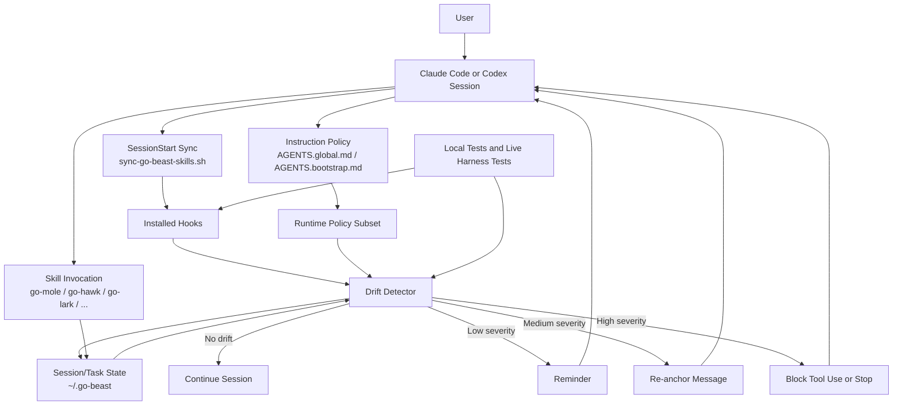

# Anti-Drift Component Diagram

## Notes

- `SessionStart` keeps assets current, but the anti-drift guard acts during the
  session, not only at startup.
- The state store is intentionally small and operational, not a replay log of
  the whole conversation.
- Skill invocation feeds state updates so the detector can tell what should
  happen next.
