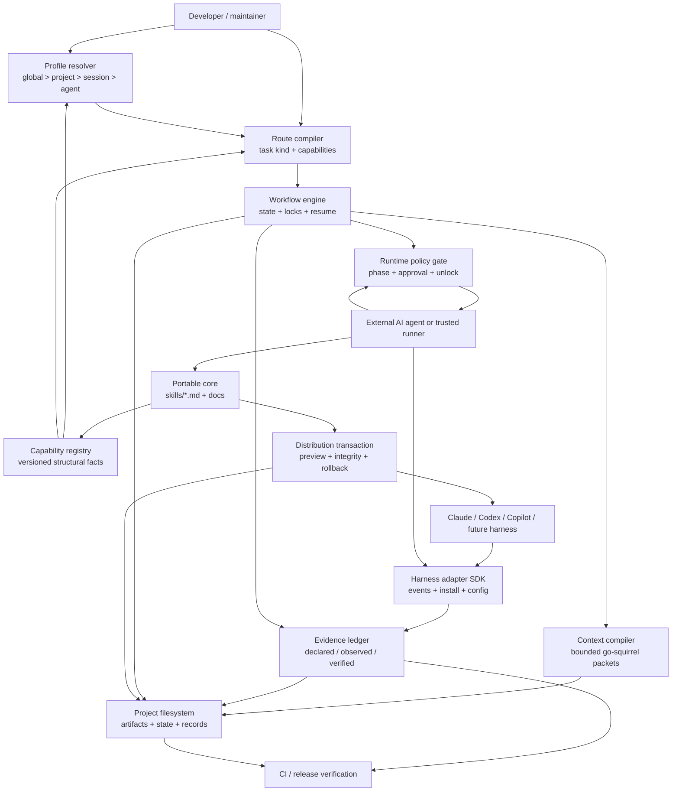

# Go Beast v2 component diagram

## Boundary notes

- `skills/` remains the semantic and procedural source; the registry contains
  only structural metadata.
- The external agent remains responsible for substantive work. The control
  plane coordinates, gates, records, and verifies observable evidence.
- The project filesystem is the default durable boundary. User prompts and
  secrets are not copied into the ledger or context automatically.
- Adapters can expose less capability than the core and must report that gap
  rather than silently pretending parity.
