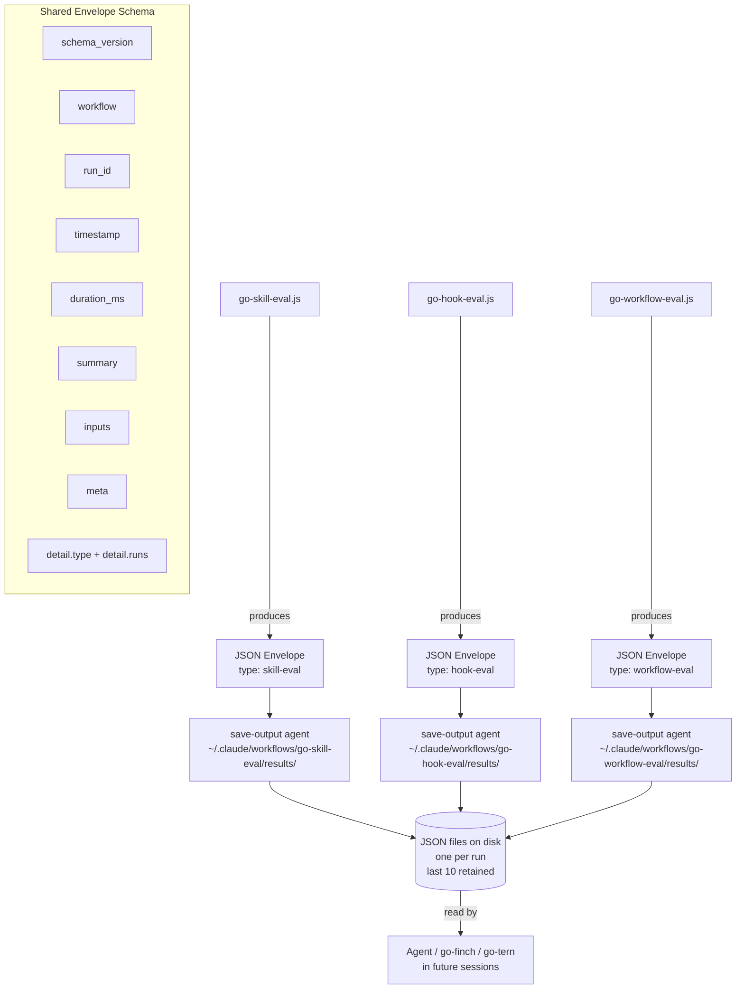

# eval-output Component Diagram

## Notes

- All three workflows emit the same envelope shape; only `detail.type` and
  `detail.runs` differ.
- The `save-output` agent call mirrors the existing `save-report` pattern.
- Retention is enforced at write time: files beyond the last 10 are deleted
  before writing the new one.
- Agents reading results navigate: `result.summary` for aggregate decisions,
  `result.detail.runs` for per-item findings.
