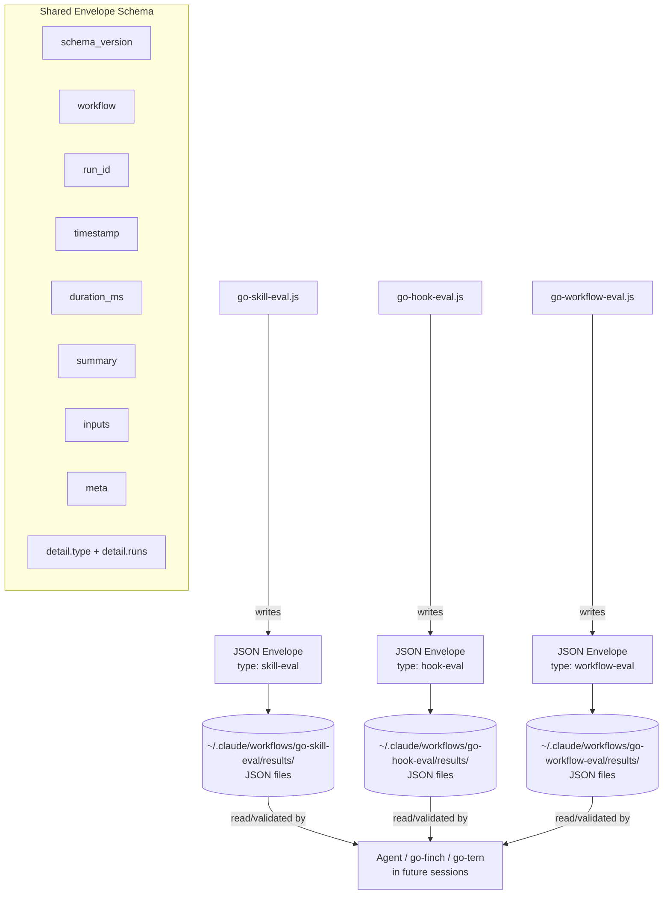

# eval-output Component Diagram

## Notes

- All three workflows emit the same envelope shape; only `detail.type` and
  `detail.runs` differ.
- Retention is enforced at write time and can be configured with
  `EVAL_KEEP_RUNS`.
- The workflows validate the written JSON immediately after save and log a
  warning if the envelope is malformed.
- Agents reading results navigate: `result.summary` for aggregate decisions,
  `result.detail.runs` for per-item findings.
