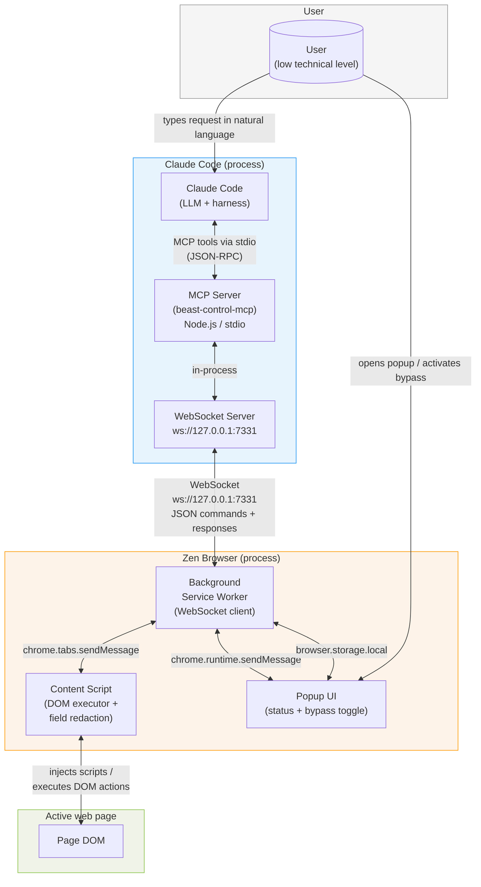
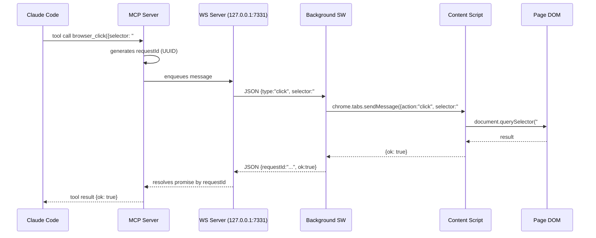
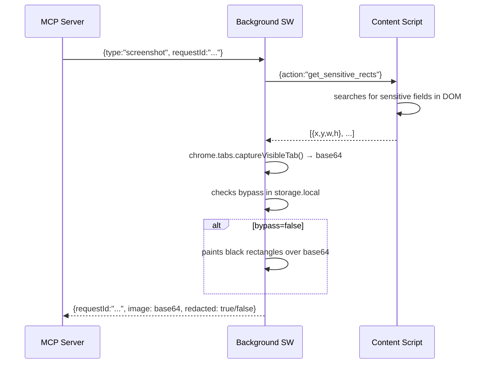
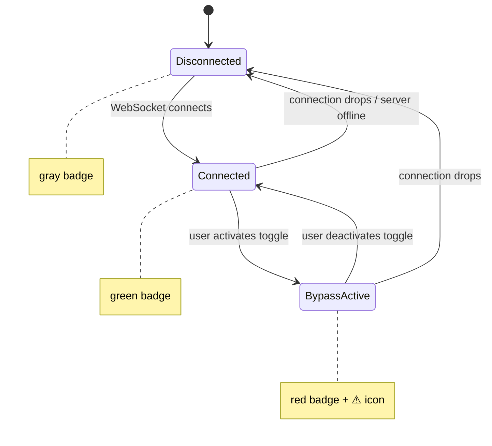

# Component Diagram — beast-control
> date: 2026-06-10

## System overview

```mermaid
flowchart TD
    subgraph USER["User"]
        U[("User\n(low technical level)")]
    end

    subgraph CLAUDE_CODE["Claude Code (process)"]
        CC["Claude Code\n(LLM + harness)"]
        MCP["MCP Server\n(beast-control-mcp)\nNode.js / stdio"]
        WSS["WebSocket Server\nws://127.0.0.1:7331"]
        CC <-->|"MCP tools via stdio\n(JSON-RPC)"| MCP
        MCP <-->|"in-process"| WSS
    end

    subgraph ZEN["Zen Browser (process)"]
        BG["Background\nService Worker\n(WebSocket client)"]
        CS["Content Script\n(DOM executor +\nfield redaction)"]
        POP["Popup UI\n(status + bypass toggle)"]
        BG <-->|"chrome.tabs.sendMessage"| CS
        BG <-->|"chrome.runtime.sendMessage"| POP
        POP <-->|"browser.storage.local"| BG
    end

    subgraph PAGE["Active web page"]
        DOM["Page DOM"]
    end

    U -->|"types request in natural language"| CC
    U -->|"opens popup / activates bypass"| POP

    WSS <-->|"WebSocket\nws://127.0.0.1:7331\nJSON commands + responses"| BG
    CS <-->|"injects scripts /\nexecutes DOM actions"| DOM

    style USER fill:#f5f5f5,stroke:#999
    style CLAUDE_CODE fill:#e8f4fd,stroke:#2196F3
    style ZEN fill:#fdf3e8,stroke:#FF9800
    style PAGE fill:#f0f4e8,stroke:#8BC34A
```

## Command flow (e.g. `browser_click`)

```mermaid
sequenceDiagram
    participant CC as Claude Code
    participant MCP as MCP Server
    participant WSS as WS Server (127.0.0.1:7331)
    participant BG as Background SW
    participant CS as Content Script
    participant DOM as Page DOM

    CC->>MCP: tool call browser_click({selector: "#btn"})
    MCP->>MCP: generates requestId (UUID)
    MCP->>WSS: enqueues message
    WSS->>BG: JSON {type:"click", selector:"#btn", requestId:"..."}
    BG->>CS: chrome.tabs.sendMessage({action:"click", selector:"#btn"})
    CS->>DOM: document.querySelector("#btn").click()
    DOM-->>CS: result
    CS-->>BG: {ok: true}
    BG-->>WSS: JSON {requestId:"...", ok:true}
    WSS-->>MCP: resolves promise by requestId
    MCP-->>CC: tool result {ok: true}
```

## Screenshot flow with redaction

```mermaid
sequenceDiagram
    participant MCP as MCP Server
    participant BG as Background SW
    participant CS as Content Script

    MCP->>BG: {type:"screenshot", requestId:"..."}
    BG->>CS: {action:"get_sensitive_rects"}
    CS->>CS: searches for sensitive fields in DOM
    CS-->>BG: [{x,y,w,h}, ...]
    BG->>BG: chrome.tabs.captureVisibleTab() → base64
    BG->>BG: checks bypass in storage.local
    alt bypass=false
        BG->>BG: paints black rectangles over base64
    end
    BG-->>MCP: {requestId:"...", image: base64, redacted: true/false}
```

## Extension badge states

```mermaid
stateDiagram-v2
    [*] --> Disconnected
    Disconnected --> Connected: WebSocket connects
    Connected --> Disconnected: connection drops / server offline
    Connected --> BypassActive: user activates toggle
    BypassActive --> Connected: user deactivates toggle
    BypassActive --> Disconnected: connection drops

    note right of Disconnected: gray badge
    note right of Connected: green badge
    note right of BypassActive: red badge + ⚠️ icon
```
