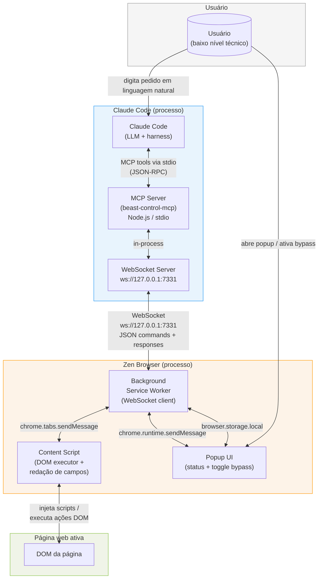
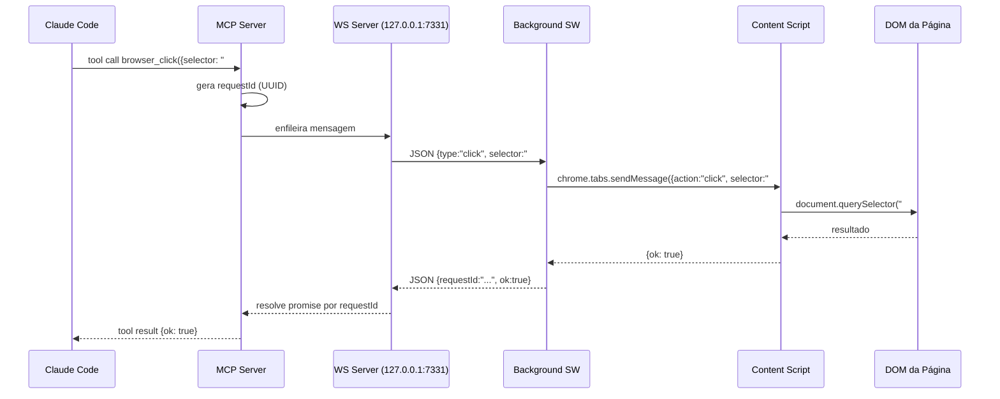
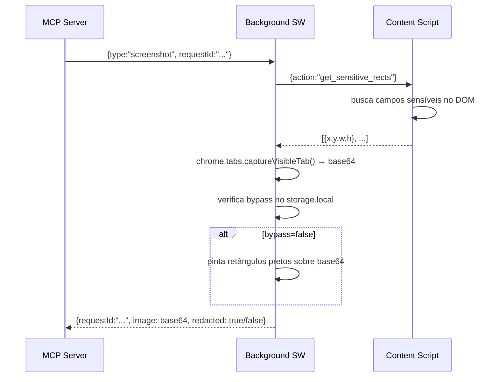
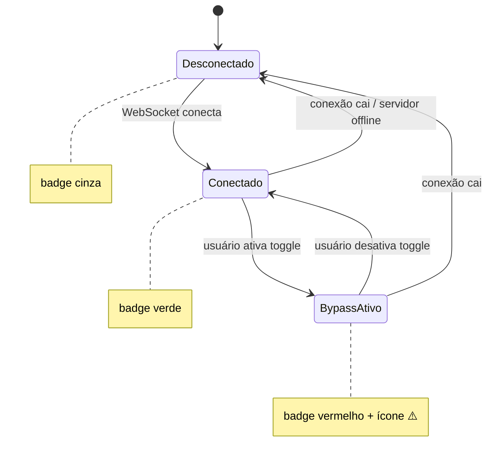

# Component Diagram — beast-control
> date: 2026-06-10

## Visão geral do sistema

## Fluxo de um comando (ex: `browser_click`)

## Fluxo de screenshot com redação

## Estados do badge da extensão

