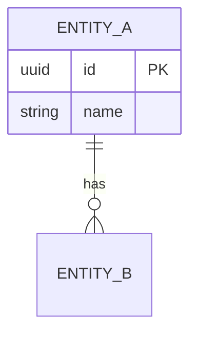

# go-otter — Database Design & Migrations

go-otter manages what lives in the water. It designs schemas that are correct from the start and evolves them safely over time — no destructive surprises.

## Quick start

```
Prerequisites: functional requirements from go-hawk, stack decision from go-fox
→ invoke go-otter
→ ER model → schema → migrations → indexes → seed data
```

## Workflow

### 1. Entity-relationship model

Before any SQL or ORM code:
- List all entities and attributes
- Define relationships: 1:1, 1:N, N:M
- Identify required / unique / indexed / nullable fields
- Produce the diagram as a fenced Mermaid code block:

````md

````

This block is a mandatory deliverable. Do not describe the model in prose only and do not proceed to migrations until the `erDiagram` block is written.

### 2. Schema conventions

- Table names: `snake_case`, plural (`users`, `order_items`)
- Primary key: UUID v4 by default; integer only if UUID is a proven bottleneck
- Timestamps: `created_at` and `updated_at` on every table (auto-managed)
- Soft delete: `deleted_at` nullable timestamp — never hard `DELETE`
- Foreign keys: always explicit with `ON DELETE` behavior stated

### 3. Migration rules

- One migration per logical change. Never bundle unrelated changes.
- Every migration needs `up` and `down`. Test `down` before merging.
- Never modify a migration after it has been applied to any environment.
- Naming: `YYYYMMDDHHMMSS_describe_change.sql`
- If a migration cannot roll back without data loss, state it in the file header.

### 4. Indexing strategy

Add an index when: column used in `WHERE` with high selectivity · column used in `JOIN` · column used in `ORDER BY` on a large table.

Never add indexes speculatively — every index has a write-time cost. Composite indexes: most selective column first.

### 5. Query review

For any query touching more than one table or returning > 1000 rows:
- [ ] `EXPLAIN ANALYZE` — no sequential scans on large tables
- [ ] No N+1 patterns in ORM usage

### 6. Seed data

Seed script must be idempotent. Never seed production with development data.

### 7. Backup and recovery

Document in `docs/DATABASE.md`: backup schedule, point-in-time recovery procedure, RTO and RPO targets.

## Rules

- Never `DROP COLUMN` or `DROP TABLE` in the same migration that removes references. Two-step: remove references, then drop.
- Never run raw SQL with string interpolation. Always use parameterized queries or ORM bindings.
- Large-table changes (rename, add NOT NULL without default) require a migration safety review.

## Output

- ER diagram in `docs/architecture/task-artifacts/DIAGRAM.md`
- Migration files under `db/migrations/`
- `docs/DATABASE.md` — schema reference, naming conventions, backup plan
- Seed script under `db/seeds/`
